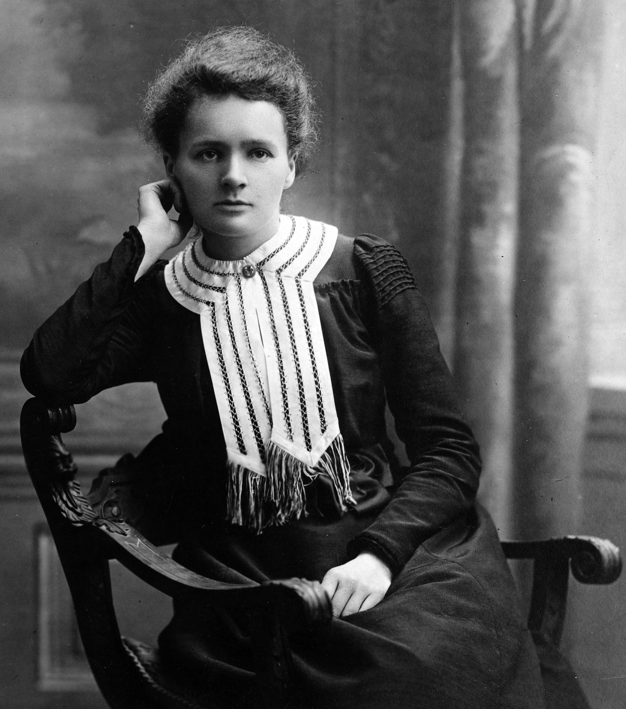
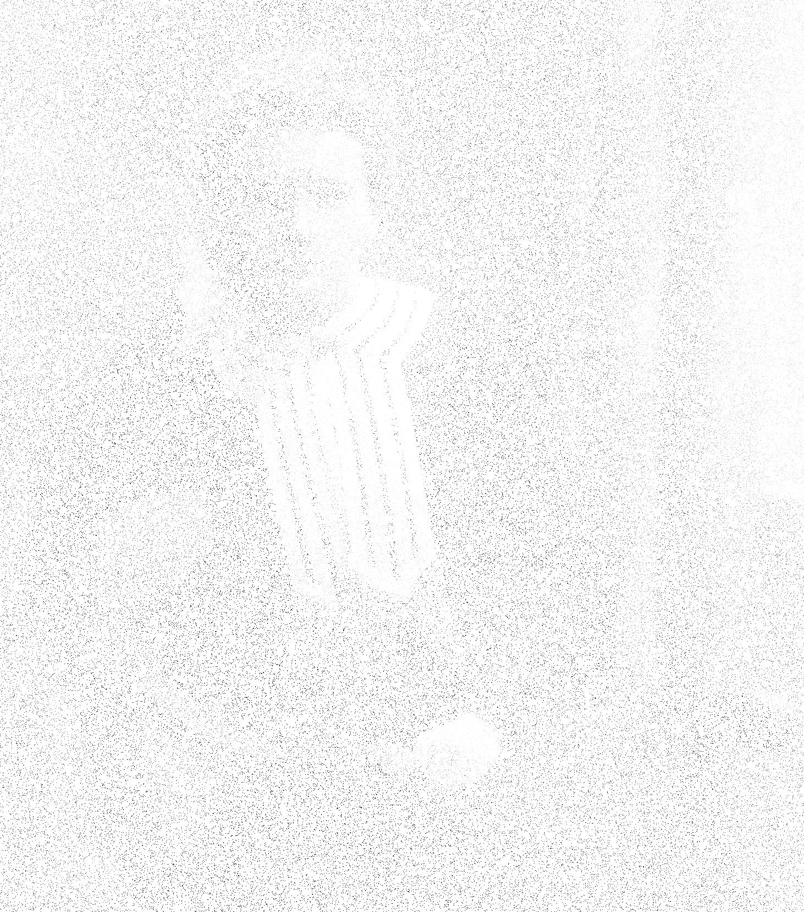

#pit   ---  Pictures: Iterative Thresholding algorithms

## A compressed sensing based image recovery demonstration 

Simple and fast implementation of the *iterative hard and soft threosholding algorithms* (IHT and ISTA) for image recovery. It provides:

* Reconstructions of images from few of their pixels (masked images)
  (see the Jupyter notebook demoIHT.ipynb for a working example)
* It relies on the images being sparse under
    - The fast *discrete cosine transform* (DCT) 
      (based on [scipy.fftpack.dct](https://docs.scipy.org/doc/scipy-0.14.0/reference/generated/scipy.fftpack.dct.html))
    - The fast *wavelet transform* (WT) 
      (based on [pywt.wavedec2](http://pywavelets.readthedocs.io/en/latest/ref/2d-dwt-and-idwt.html))
* Possible thresholding operations:
    - Hard thresholding (IHT)
    - Soft thresholding (ISTA)
* A demonstration of the functioning of image compression is included
  (Jupyter notebook [demo_image_compression.ipynb](./demo_image_compression.ipynb))

### How to run it
A simple example can be found in the Jupyter notebook [demoIHT.ipynb](./demoIT.ipynb). 

## Description of what it does
Given a picture (left image) we remove a large number of its pixels (middle image). Then we can reconstructs the image (right image) from the middle one; see the Jupyter notebook [demo_image_compression.ipynb](./demo_image_compression.ipynb) on how it is done.

Given picture | 95% of its pixels removed | Reconstruction 
:-------------------------:|:-------------------------:|:-------------------------:
 |  | 

## How it works (theory)
Images are compressible (see [demo_image_compression.ipynb](./demo_image_compression.ipynb) for an illustration). Effectively, the reconstruction algorithms of **pit** search for an image in *the space of compressed images* that is compatible with the given pixels. 

### Mathematical description
Let *T* be an invertible transformation taking images to vectors so that the vectors are sparse (i.e., many coefficients are zero) and let *iT* be the inverse of *T*. Examples for such a *T* are the DCT and many versions of the WT. Moreover, let *TO* be a thresholding operator (hard or soft thresholding). 

Suppose we are given a subset of pixels *Xsub* of an image *Xorig* and the indices *mask* of these pixels. Then the reconstruction algorithm *pit.estimate* essentially does the following iteration:

    X = Xsub
    repeat
        x = TO( T(X) )
        X = iT(x)
    until a stopping criterion is met

For certain transformations *T* this algorithm essentially solves the problem:

    minimize     norm( T(X), L1 )
    subject to   norm( X(mask) - Xsub, Frobenius) <= eta

In order to rigorously guarantee this procedure to work *T* needs to satisfy certain properties. If *X* is sparse and there are enough pixels in *Xsub* (depending on the sparsity of *X*) then the minimum is attained for *Xrec* that is *eta*-close to *X* in Frobenius norm. 

### References
* S. Foucart and H. Rauhut, *A mathematical introduction to compressive sensing* (Birkhäuser, 2013)
* J. Bobin, J.-L. Starck, and R. Ottensamer, *Compressed Sensing in Astronomy*, [arXiv:0802.0131](http://arxiv.org/abs/0802.0131)
* A. Beck and M. Teboulle, *A fast iterative shrinkage-thresholding algorithm for linear inverse problems*, SIAM J. Imaging Sci., 2(1), 183–202 (2009)